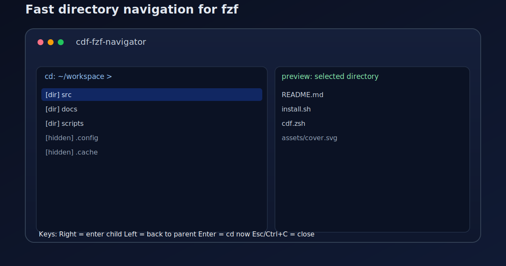

# cdf-fzf-navigator

[中文](./README.md) | [**English**](./README.en.md)



An `fzf`-based directory navigator: press `Alt+C` to open the tree, use left/right arrows to move, and press `Enter` once to jump to the target directory.

## Why this project exists

### Background
- Deep project trees make `cd` + `ls` repetitive and slow.
- Mixed Chinese/English folder names increase typing errors.
- Terminal navigation should feel closer to file-manager behavior: forward, back, preview, confirm.

### What it does
- `Alt+C` opens interactive directory navigation.
- Right arrow enters a child directory, left arrow goes to parent.
- `Enter` confirms and runs `cd` immediately.
- `Esc` / `Ctrl+C` exits anytime.
- Right preview shows filenames only for lower noise.
- Default order: normal folders first, hidden folders later; `Ctrl+O` toggles name/size sort.
- Returning to parent keeps the cursor on the previously entered item.

## One-line AI setup prompt

Copy this single line to your AI terminal assistant:

```text
Fetch and follow instructions from https://raw.githubusercontent.com/qiunai/cdf-fzf-navigator/refs/heads/main/.codex/INSTALL.md
```

This link stays unchanged. Each run reads the latest install instructions from `main` and syncs local setup to the latest installer.

## Manual installation

### 1) Prerequisites
- `zsh` or `bash` (recommended: `zsh`)
- `fzf`
- Homebrew on macOS (for automatic dependency install)

> `install.sh` auto-detects shell and runs `brew install fzf` when `fzf` is missing.

### 2) Clone repository

```bash
TARGET_DIR="$HOME/.local/src/cdf-fzf-navigator"
git clone https://github.com/qiunai/cdf-fzf-navigator.git "$TARGET_DIR"
cd "$TARGET_DIR"
```

### 3) Configure shell startup (automatic)

```bash
bash install.sh --shell auto
```

Installer behavior:
- Copies core script to `${XDG_CONFIG_HOME:-$HOME/.config}/cdf-fzf-nav/cdf.zsh`
- Writes shell config into `~/.zshrc` or `~/.bashrc`
- Makes `cdf` and `Alt+C` available every time a new terminal opens

Apply immediately:

```bash
# zsh
source ~/.zshrc

# bash
source ~/.bashrc
```

## Usage
- `Alt+C`: open navigator
- `→`: enter child directory
- `←`: go back to parent
- `Enter`: confirm and change directory
- `Esc` / `Ctrl+C`: exit
- `Ctrl+O`: toggle sort mode (name / directory size)

## Repository structure (example)

```text
cdf-fzf-navigator/
├── .codex/
│   └── INSTALL.md
├── assets/
│   └── cover.svg
├── cdf.zsh
├── install.sh
├── README.en.md
├── README.md
└── LICENSE
```

## License

Released under the [MIT License](./LICENSE).
